<div align="center">

# 🛡️ Packet Analyzer Platform
### Deep Packet Inspection • Network Traffic Analysis • Intelligent Firewall • Analytics Dashboard

<p align="center">

A full-stack **Deep Packet Inspection (DPI) Platform** that combines a high-performance **C++ packet processing engine** with a modern **React dashboard** and **Node.js backend** to analyze PCAP files, classify network traffic, generate analytics, and simulate enterprise-grade firewall management.

---

### 🌐 Live Demo

https://packetanalyzer-frontend.onrender.com

</p>


</div>

---

# Table of Contents

- Introduction
- Why This Project Exists
- Features
- Technology Stack
- System Architecture
- Packet Journey
- Project Structure
- Frontend Architecture
- Backend Architecture
- DPI Engine
- Firewall System
- Analytics Engine
- Report Generation
- API Overview
- Installation
- Running the Project
- Performance
- Future Improvements

---

# Introduction

Modern organizations generate enormous amounts of network traffic every second.

Traditional firewalls only inspect packet headers such as IP addresses, ports and protocols. While this is sufficient for basic filtering, it cannot determine **what application is actually communicating** or **what services are being accessed**.

Deep Packet Inspection (DPI) solves this problem by inspecting the packet payload and protocol metadata to identify applications such as:

- YouTube
- Facebook
- Google
- GitHub
- DNS
- HTTP
- HTTPS

This project extends a custom-built **C++ DPI Engine** into a complete web platform where users can upload PCAP captures, inspect network traffic, manage firewall rules and visualize detailed analytics through an interactive dashboard.

Instead of working only from the command line, the entire packet inspection workflow can now be performed through an intuitive browser interface.

---

# Why This Project Exists

Most academic packet analyzers stop after parsing packets.

This project goes significantly further by demonstrating how packet inspection engines are integrated into modern software systems.

The platform combines three independent systems:

- A high-performance C++ Deep Packet Inspection Engine
- A REST API backend built with Express.js
- A React frontend for visualization and firewall management

Together they simulate the architecture commonly found in enterprise network security products.

Examples include:

- Cisco Firepower
- Palo Alto Networks
- Suricata
- Zeek
- Wireshark (analysis workflow)

---

# What This Platform Can Do

✔ Upload PCAP files directly from the browser

✔ Execute packet inspection using the C++ analysis engine

✔ Parse Ethernet, IPv4, TCP and UDP packets

✔ Extract TLS Server Name Indication (SNI)

✔ Classify network traffic by application

✔ Detect HTTPS services without decrypting traffic

✔ Manage firewall rules

✔ Block applications

✔ Block IP addresses

✔ Block domains

✔ Generate traffic analytics

✔ Display protocol distribution

✔ Display application statistics

✔ Generate inspection reports

✔ View packet summaries through an interactive dashboard

---

# Technology Stack

## Frontend

- React
- Vite
- Tailwind CSS
- Axios
- React Router

---

## Backend

- Node.js
- Express.js
- REST APIs
- Child Process Integration
- File Upload Handling

---

## DPI Engine

- Modern C++
- Multi-threading
- PCAP Parsing
- TLS Inspection
- Flow Tracking
- Rule Engine
- Traffic Classification

---

## Networking Concepts

- Ethernet
- IPv4
- TCP
- UDP
- DNS
- HTTP
- HTTPS
- TLS
- SNI Extraction

---

# High Level Architecture

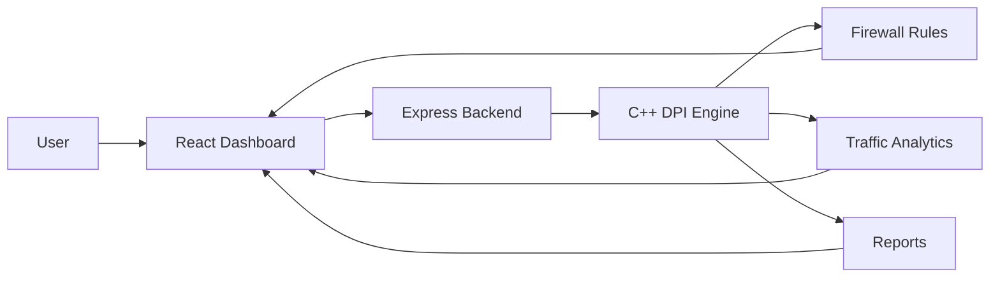

The platform separates responsibilities into three independent layers.

The React frontend focuses entirely on user interaction.

The Express backend acts as an orchestration layer that receives uploaded PCAP files, manages firewall configurations and communicates with the packet processing engine.

The C++ engine performs all heavy network analysis before returning structured results back to the backend.

---

# Complete Processing Pipeline

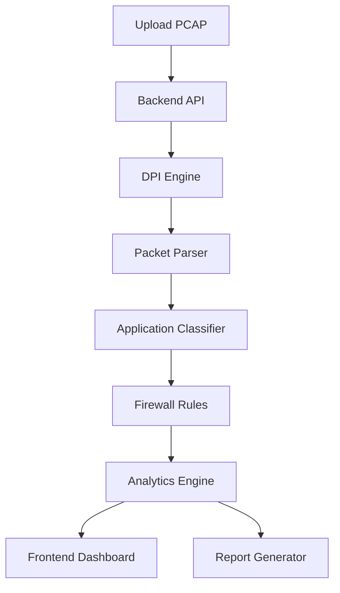

The workflow begins when a PCAP file is uploaded through the web interface.

The backend stores the uploaded capture and invokes the native C++ packet inspection engine.

The engine parses every packet, extracts protocol information, identifies applications using TLS SNI extraction and applies firewall rules.

Once packet processing is complete, the generated statistics are returned to the backend as structured data.

Finally, the frontend renders analytics, firewall status and packet summaries for the user.

# How the Entire System Works

The Packet Analyzer Platform is composed of three independent layers that work together to analyze captured network traffic.

- **React Frontend** provides an interactive dashboard for uploading PCAP files, managing firewall rules, and visualizing analytics.
- **Express Backend** acts as the orchestration layer, exposing REST APIs, managing uploads, invoking the native engine, and returning structured results.
- **C++ DPI Engine** performs the actual packet inspection, protocol parsing, traffic classification, and statistics generation.

This separation keeps the application modular, scalable, and easy to extend.

---


# Installation

## Prerequisites

Before running the project, ensure the following software is installed.

### Frontend

- Node.js (18+)
- npm

### Backend

- Node.js
- Express.js
- npm

### Native Engine

- C++17 Compatible Compiler
- CMake
- Make
- GCC / Clang

---

# Clone the Repository

```bash
git clone https://github.com/MainakDebnath6/PacketAnalyzer.git

cd PacketAnalyzer
```

---

# Project Structure

```text
PacketAnalyzer/

├── frontend/          # React Dashboard
├── backend/           # Express APIs
├── cpp-engine/        # Native DPI Engine
└── README.md
```

---

# Installing Dependencies

## Frontend

```bash
cd frontend

npm install
```

---

## Backend

```bash
cd backend

npm install
```

---

## Build the C++ Engine

```bash
cd cpp-engine

mkdir build

cd build

cmake ..

make
```

---

# Running the Project

The application consists of three independent services.

---

## 1. Start the Backend

```bash
cd backend

npm start
```

---

## 2. Start the Frontend

```bash
cd frontend

npm run dev
```

---

## 3. Run the Native Engine

The backend automatically invokes the C++ engine whenever a PCAP file is uploaded.

If required, it can also be executed manually.

```bash
./dpi_engine input.pcap output.json
```

---

# Live Demo

The deployed version of the application is available here.

## 🌐 https://packetanalyzer-frontend.onrender.com

---

# API Overview

| Method | Endpoint | Description |
|----------|------------------------|--------------------------------|
| POST | /api/scan/upload | Upload a PCAP file |
| GET | /api/dashboard | Dashboard statistics |
| GET | /api/analytics | Traffic analytics |
| GET | /api/firewall | Current firewall rules |
| POST | /api/firewall | Add firewall rule |
| DELETE | /api/firewall | Remove firewall rule |
| GET | /api/reports | Generated reports |

---

# Performance Characteristics

The platform separates responsibilities across three layers.

| Component | Responsibility |
|------------|----------------|
| React | User Interface |
| Express | API Gateway |
| C++ | Packet Processing |

This architecture provides several advantages.

- Native packet processing performance
- Lightweight frontend
- Modular backend services
- Easy feature expansion
- Independent deployment of each component

---

# Current Features

- ✅ PCAP Upload
- ✅ Packet Parsing
- ✅ Ethernet Parsing
- ✅ IPv4 Parsing
- ✅ TCP Parsing
- ✅ UDP Parsing
- ✅ TLS SNI Extraction
- ✅ Application Detection
- ✅ Flow Tracking
- ✅ Firewall Rule Management
- ✅ Analytics Dashboard
- ✅ Report Generation
- ✅ Interactive Web Interface

---

# Future Improvements

The current implementation provides a strong foundation for a production-style packet analysis platform.

Potential future enhancements include:

- Live Packet Capture
- WebSocket-based Real-time Dashboard
- IDS / IPS Detection
- Intrusion Alerts
- GeoIP Visualization
- Threat Intelligence Integration
- Machine Learning Traffic Classification
- HTTP/3 & QUIC Support
- User Authentication
- Role-Based Access Control
- Docker Deployment
- Kubernetes Support
- Prometheus Metrics
- Grafana Monitoring

---

# Screenshots

## Dashboard

> Add Dashboard Screenshot Here

---

## Analytics

> Add Analytics Screenshot Here

---

## Firewall

> Add Firewall Screenshot Here

---

## Reports

> Add Reports Screenshot Here

---

# Learning Outcomes

This project demonstrates practical knowledge of:

- Computer Networks
- Deep Packet Inspection
- TLS Protocol
- Packet Parsing
- Flow Tracking
- Firewall Design
- Network Analytics
- React Development
- Express.js
- REST APIs
- C++
- Multi-threading
- System Architecture
- Full Stack Development

---

# Why This Project Matters

This project combines systems programming with modern web development to demonstrate how enterprise network security platforms are built.

Rather than limiting packet analysis to a command-line application, it integrates a high-performance native DPI engine with a full-stack web interface capable of processing, visualizing, and managing network traffic through an intuitive dashboard.

It showcases concepts commonly used in commercial network monitoring and security products while remaining approachable for learning and experimentation.

---

<div align="center">

## ⭐ If you found this project interesting, consider giving it a Star.

Made with ❤️ by **Mainak Debnath**

</div>

## Overall Architecture

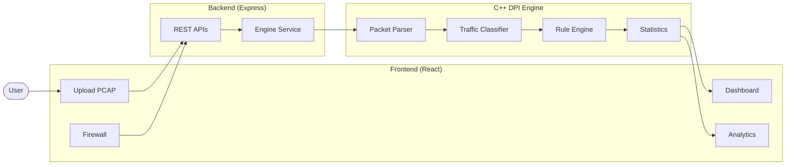

---

# Packet Journey

Every uploaded PCAP follows the same processing pipeline.

---

## Step 1 — Upload

The user uploads a PCAP capture through the web dashboard.

```text
PCAP File
     │
     ▼
React Frontend
```

The frontend validates the file before sending it to the backend using a multipart upload request.

---

## Step 2 — Backend Processing

The Express backend receives the uploaded file.

Instead of analyzing packets itself, it invokes the native C++ DPI Engine.

```text
Browser
   │
   ▼
Express Server
   │
   ▼
Engine Service
   │
   ▼
C++ DPI Engine
```

This architecture combines the flexibility of JavaScript with the performance of native C++.

---

## Step 3 — Reading the Capture

The DPI engine reads the PCAP sequentially.

```text
PCAP File
   │
   ▼
Global Header
   │
   ▼
Packet Header
   │
   ▼
Packet Payload
   │
   ▼
Next Packet
```

Each packet is loaded into memory before being passed to the parser.

---

## Step 4 — Packet Parsing

Every packet is decoded layer by layer.

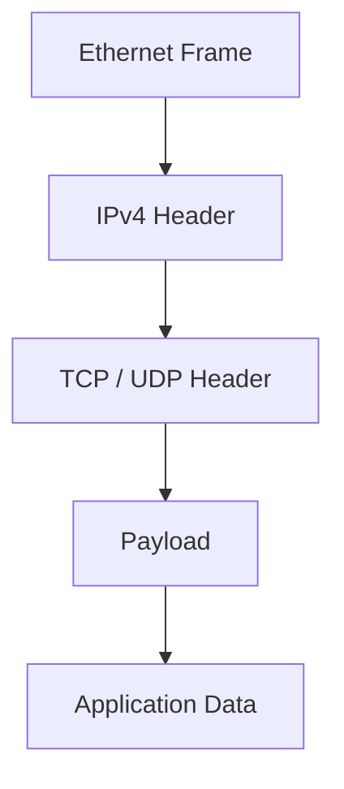

The parser extracts:

- Source MAC
- Destination MAC
- Source IP
- Destination IP
- Source Port
- Destination Port
- Protocol
- Payload

These fields become the foundation for traffic analysis.

---

## Step 5 — Flow Identification

Packets are grouped into **network flows** using the Five Tuple.

| Field | Description |
|--------|-------------|
| Source IP | Client Address |
| Destination IP | Server Address |
| Source Port | Client Port |
| Destination Port | Server Port |
| Protocol | TCP / UDP |

All packets sharing the same Five Tuple belong to the same connection.

---

## Step 6 — Deep Packet Inspection

After parsing the transport layer, the engine performs Deep Packet Inspection (DPI).

Instead of relying only on IP addresses and ports, the engine examines protocol metadata to identify the application responsible for the traffic.

Supported classifications include:

- HTTP
- HTTPS
- DNS
- Google
- YouTube
- Facebook
- GitHub

For HTTPS traffic, the engine extracts the **TLS Server Name Indication (SNI)** from the Client Hello packet, allowing application identification without decrypting encrypted traffic.

---

## Step 7 — Traffic Classification

The extracted SNI is mapped to an application.

```text
TLS Client Hello
        │
        ▼
Extract SNI
        │
        ▼
www.youtube.com
        │
        ▼
Application = YouTube
```

Once a flow has been classified, every subsequent packet belonging to that flow inherits the same classification.

---

## Step 8 — Firewall Evaluation

Each classified flow is checked against the configured firewall policies.

The engine evaluates:

- Blocked Applications
- Blocked Domains
- Blocked IP Addresses

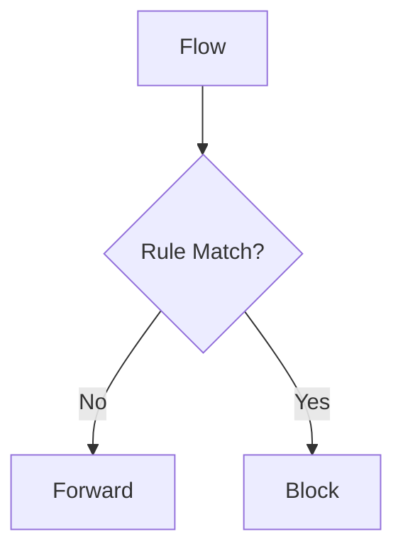

If any rule matches, the flow is blocked; otherwise it continues to the analytics engine.

---

## Step 9 — Analytics Generation

Every processed packet contributes to live statistics such as:

- Total Packets
- TCP / UDP Distribution
- Application Breakdown
- Traffic Volume
- Active Connections
- Blocked Traffic
- Detected Domains

These statistics are converted into structured JSON before being returned to the backend.

---

## Step 10 — Dashboard Visualization

The backend sends the processed analytics to the frontend.

The React dashboard renders:

- Interactive Charts
- Traffic Statistics
- Firewall Status
- Application Breakdown
- Reports
- Packet Summaries

This transforms raw network captures into an easy-to-understand visual analysis platform.

---

# Project Structure

```text
packet-analyzer/

├── frontend/
│   ├── Dashboard
│   ├── Upload
│   ├── Analytics
│   ├── Firewall
│   └── Reports
│
├── backend/
│   ├── REST APIs
│   ├── Engine Service
│   ├── Upload Service
│   ├── Analytics Service
│   └── Firewall Service
│
└── cpp-engine/
    ├── PCAP Reader
    ├── Packet Parser
    ├── Flow Tracker
    ├── SNI Extractor
    ├── Rule Manager
    └── Statistics Engine
```

Each module has a dedicated responsibility, making the project modular, maintainable, and easy to scale as new features are introduced.

# Frontend Architecture

The frontend serves as the primary interface between the user and the Deep Packet Inspection platform. Built with **React** and **Vite**, it provides a responsive dashboard for uploading packet captures, configuring firewall rules, and exploring analytics generated by the C++ engine.

Rather than performing packet analysis inside the browser, the frontend communicates exclusively with the backend through REST APIs, keeping the client lightweight while allowing the backend to handle processing-intensive tasks.

---

## Frontend Architecture

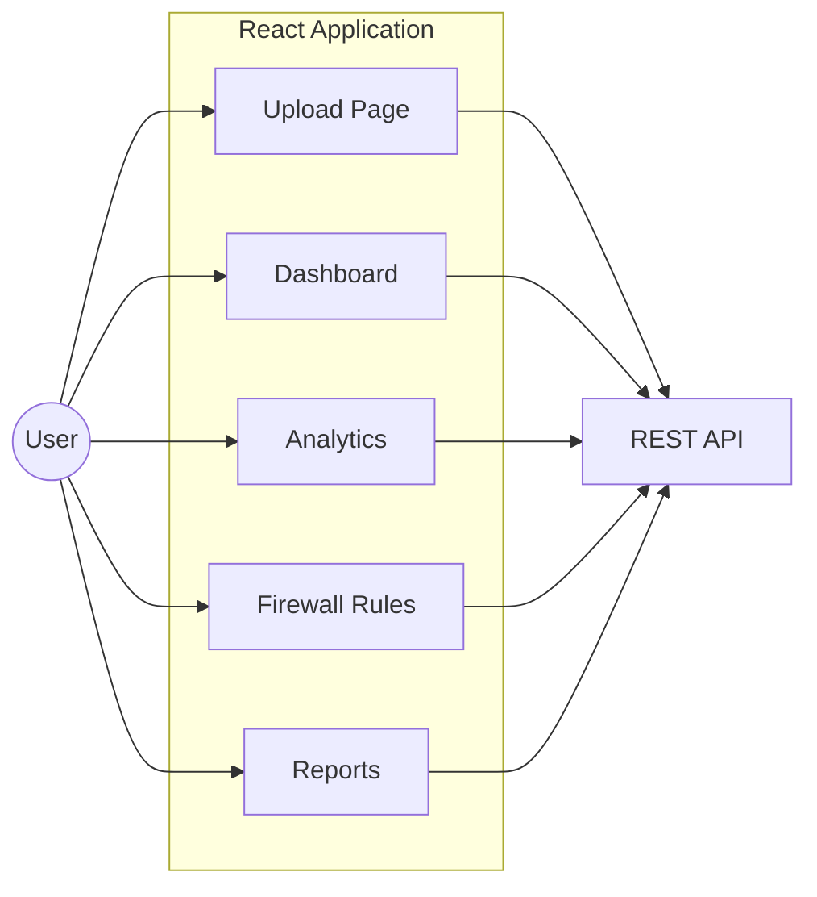

---

## Frontend Responsibilities

The frontend is responsible for:

- Uploading PCAP files
- Displaying network statistics
- Visualizing protocol distributions
- Managing firewall rules
- Displaying detected applications
- Viewing generated reports
- Consuming backend APIs
- Presenting packet inspection results

It does **not** perform any packet parsing or traffic analysis itself.

---

# Backend Architecture

The backend acts as the central controller of the platform.

It receives requests from the frontend, manages uploaded captures, invokes the native C++ DPI engine, processes generated output, and exposes the results through REST APIs.

This design keeps the React application simple while leveraging the performance of native code.

---

## Backend Workflow

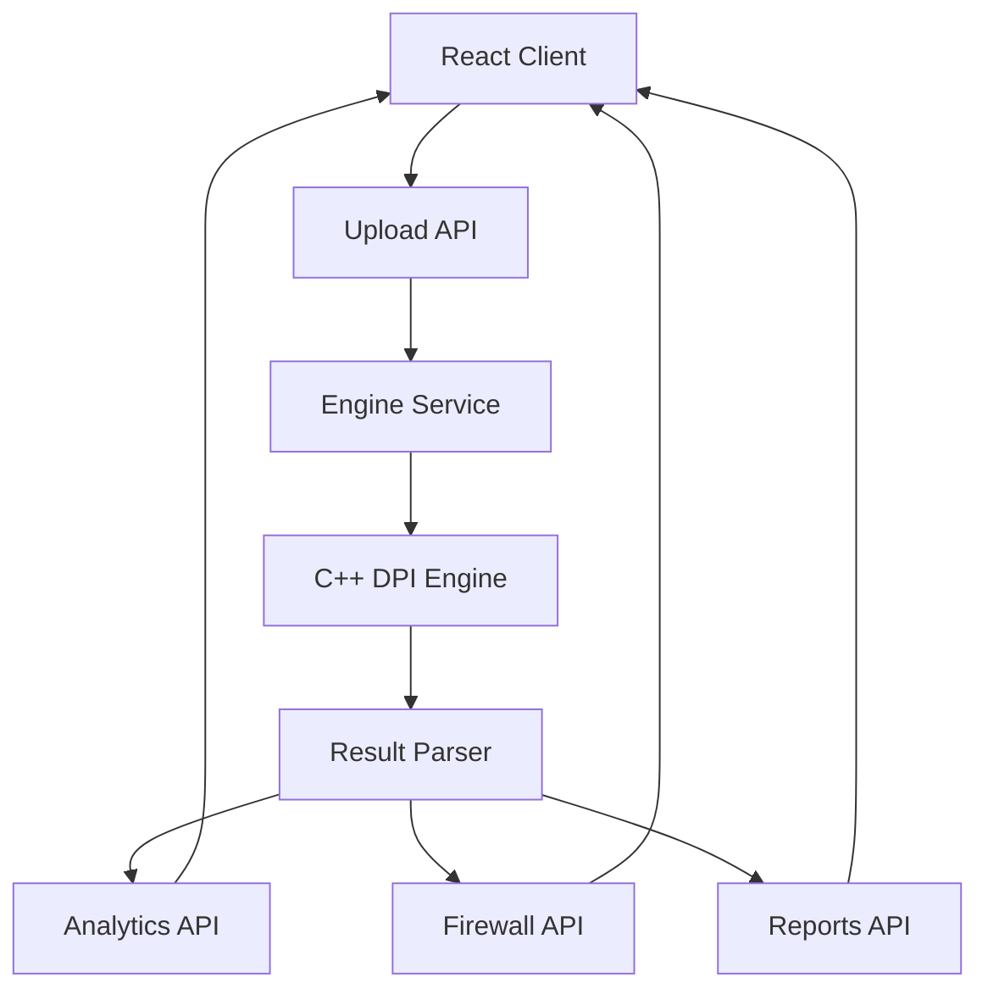

---

## Backend Responsibilities

The backend is responsible for:

- Receiving uploaded PCAP files
- Validating requests
- Managing temporary storage
- Executing the C++ engine
- Reading generated output
- Returning structured JSON
- Managing firewall configuration
- Serving analytics data
- Generating reports

---

# API Communication

The React application communicates with the backend using REST APIs.

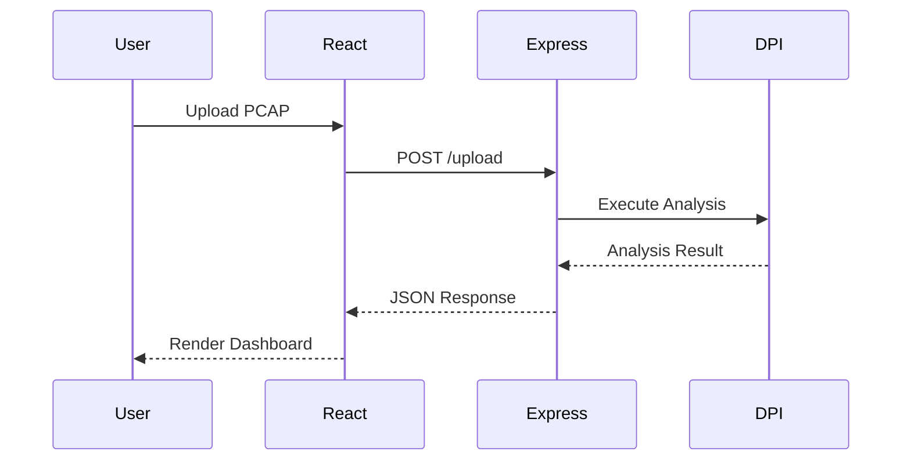

Every operation follows the same lifecycle:

1. The user performs an action through the interface.
2. React sends an HTTP request.
3. Express validates the request.
4. The backend executes the required service.
5. The C++ engine performs packet inspection.
6. Results are converted into JSON.
7. React updates the dashboard.

---

# Core Frontend Modules

## Upload Module

The upload module allows users to submit PCAP files for analysis.

Responsibilities:

- File selection
- File validation
- Upload progress
- Error handling
- Triggering backend analysis

---

## Dashboard Module

The dashboard provides an overview of the processed capture.

Typical information includes:

- Total Packets
- Active Flows
- Blocked Packets
- Allowed Packets
- Detected Applications
- Protocol Distribution

---

## Analytics Module

The analytics section transforms raw statistics into meaningful visualizations.

Examples include:

- Protocol distribution
- Traffic composition
- Application usage
- Packet counts
- Traffic trends

The goal is to make large packet captures easy to interpret.

---

## Firewall Module

The firewall interface allows users to configure filtering policies without interacting directly with the native engine.

Supported rule types include:

- Block IP Address
- Block Domain
- Block Application

Once a rule is created, it is forwarded to the backend and enforced during packet inspection.

---

## Reports Module

The reporting module presents the final inspection results.

Reports summarize:

- Traffic overview
- Protocol statistics
- Application breakdown
- Blocked traffic
- Detected domains
- Firewall activity

This enables users to quickly understand what occurred during network analysis.

---

# Why Use a Separate Backend?

Keeping the React frontend independent from the packet inspection engine provides several advantages.

- Better scalability
- Easier maintenance
- Improved security
- Native execution speed
- Clear separation of concerns
- Simplified frontend logic

The backend becomes the bridge between the web interface and the high-performance C++ analysis engine, allowing each component to focus on a single responsibility.

# Inside the C++ DPI Engine

The C++ engine is the computational core of the Packet Analyzer Platform.

While the React frontend provides visualization and the Express backend manages API communication, every packet is ultimately analyzed inside the native engine.

The engine is responsible for:

- Reading PCAP files
- Parsing network packets
- Tracking network flows
- Extracting TLS Server Name Indication (SNI)
- Classifying applications
- Applying firewall rules
- Generating analytics
- Returning structured results to the backend

---

# DPI Engine Pipeline

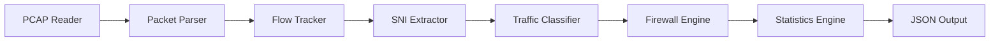

Every uploaded capture passes through this processing pipeline before results are returned to the web application.

---

# PCAP Reader

The first stage of processing is reading packets from the uploaded PCAP capture.

A PCAP file stores captured network packets together with metadata such as timestamps and packet lengths.

```text
PCAP File

├── Global Header

├── Packet Header

├── Packet Data

├── Packet Header

├── Packet Data

└── ...
```

The reader performs the following tasks:

- Opens the capture
- Reads packet headers
- Reads raw packet bytes
- Preserves timestamps
- Passes packets to the parser

At this point the engine still sees packets as raw binary data.

---

# Packet Parser

The parser converts raw bytes into structured networking information.

Each packet is decoded layer by layer.

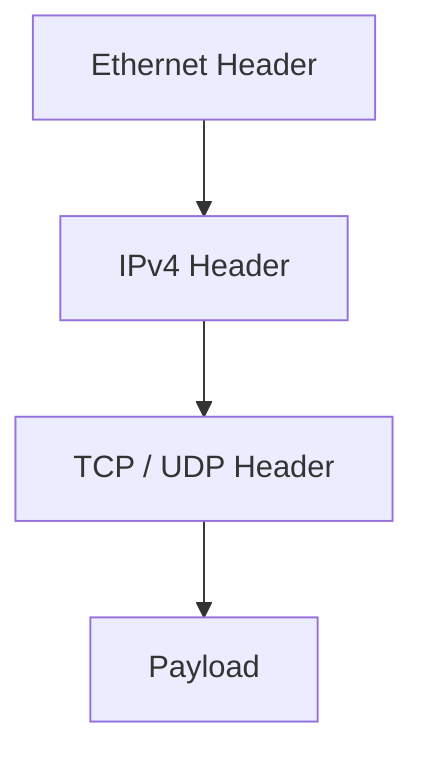

The parser extracts

- Source MAC
- Destination MAC
- Source IP
- Destination IP
- Source Port
- Destination Port
- Protocol
- Packet Length
- Payload Offset

These values become the foundation for every subsequent processing stage.

---

# Flow Tracking

Instead of processing every packet independently, packets are grouped into network flows.

Each flow is uniquely identified using the **Five Tuple**.

| Field | Description |
|--------|-------------|
| Source IP | Client Address |
| Destination IP | Server Address |
| Source Port | Client Port |
| Destination Port | Server Port |
| Protocol | TCP / UDP |

Grouping packets into flows allows the engine to:

- Track long-running connections
- Remember application classifications
- Apply firewall decisions consistently
- Generate accurate traffic statistics

---

# TLS SNI Extraction

Most modern internet traffic is encrypted using HTTPS.

Although encrypted payloads cannot be inspected directly, the TLS handshake still exposes the requested hostname through the **Server Name Indication (SNI)** field.

```text
TLS Client Hello

↓

Server Name Indication

↓

www.youtube.com

↓

Application = YouTube
```

By extracting the SNI, the engine can identify applications without decrypting user traffic.

---

# Traffic Classification

Once the protocol metadata has been extracted, each flow is mapped to a known application.

Examples include:

- HTTP
- HTTPS
- DNS
- Google
- GitHub
- Facebook
- YouTube
- Unknown

This allows the dashboard to display meaningful application analytics instead of raw IP addresses.

---

# Firewall Engine

After classification, every flow is evaluated against configured firewall rules.

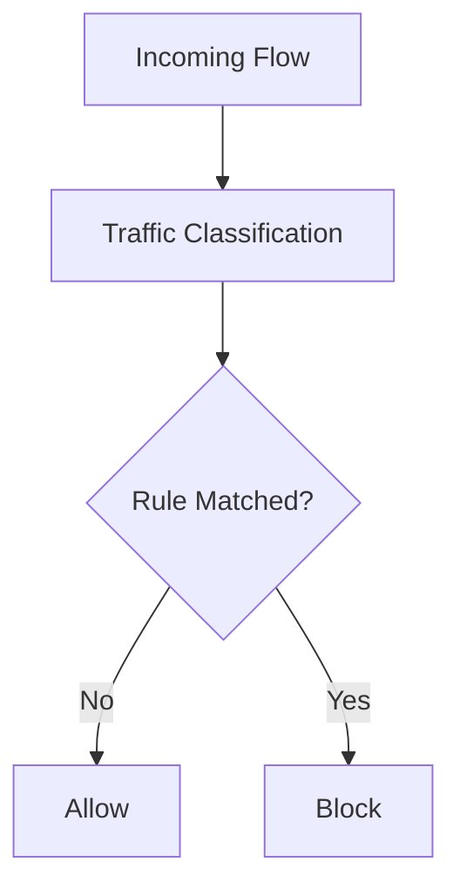

The engine currently supports:

- IP-based blocking
- Domain-based blocking
- Application-based blocking

Matching traffic is dropped while allowed traffic continues to the analytics engine.

---

# Statistics Engine

Every processed packet contributes to live traffic statistics.

Examples include:

- Total Packets
- Total Bytes
- TCP Traffic
- UDP Traffic
- Active Connections
- Blocked Packets
- Allowed Packets
- Protocol Distribution
- Application Distribution
- Detected Domains

These statistics are continuously aggregated during processing.

---

# Returning Results

Once analysis is complete, the engine exports structured results to the backend.

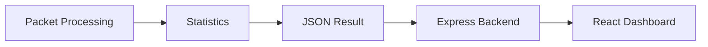

The backend parses the generated output and exposes it through REST APIs, allowing the frontend to render dashboards, reports, analytics, and firewall summaries.

---

# Why Use C++?

Packet inspection is computationally expensive.

Using C++ allows the engine to process captures significantly faster than an interpreted implementation while maintaining low memory usage.

Key advantages include:

- Native execution speed
- Efficient memory management
- High-performance packet parsing
- Better scalability for large PCAP files
- Easy integration with the web backend

This separation between the web application and the native processing engine closely mirrors the architecture used in enterprise network security products.

# Understanding Deep Packet Inspection (DPI)

Deep Packet Inspection (DPI) is a network analysis technique that examines not only packet headers but also the payload and protocol metadata carried inside each packet.

Unlike a traditional firewall that makes decisions using only IP addresses and ports, DPI can identify **which application generated the traffic**, **what services are being accessed**, and **whether that traffic should be allowed or blocked**.

This project demonstrates how a production-style DPI engine works internally while integrating it with a modern web dashboard.

---

# Traditional Firewall vs Deep Packet Inspection

| Traditional Firewall | Deep Packet Inspection |
|----------------------|-------------------------|
| Checks IP Addresses | Inspects packet contents |
| Checks Ports | Identifies Applications |
| Checks Protocol | Extracts TLS Metadata |
| Limited Visibility | Detailed Traffic Analysis |
| Basic Filtering | Intelligent Classification |

For example,

A traditional firewall only sees

```
Source IP : 192.168.1.15

Destination IP : 142.250.xx.xx

Port : 443
```

From this information it only knows that the client is communicating over HTTPS.

A DPI engine goes much further.

```
Source IP

↓

TLS Client Hello

↓

Extract SNI

↓

www.youtube.com

↓

Application = YouTube
```

Now the system knows that the user is accessing YouTube instead of simply using HTTPS.

---

# The Network Stack

Every packet passes through multiple protocol layers before reaching an application.

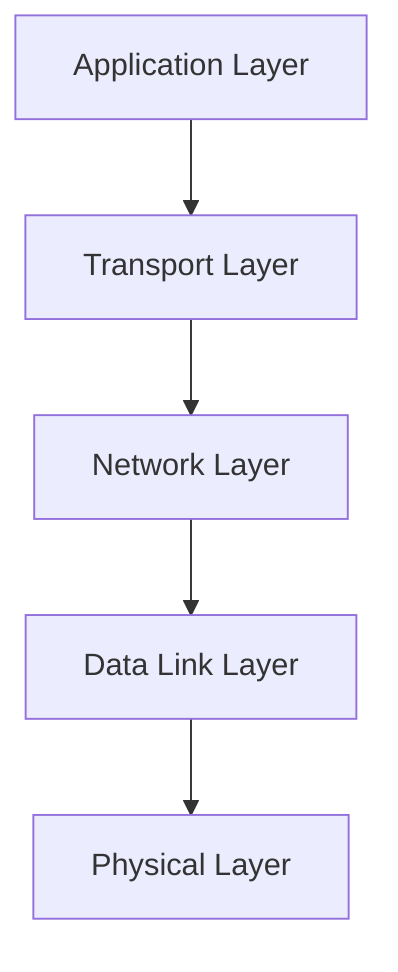

Each layer adds its own header before the packet is transmitted across the network.

---

# Packet Structure

Every network packet is composed of multiple protocol headers.

```text
+-------------------------------------------------------------+
| Ethernet Header                                              |
+-------------------------------------------------------------+
| IPv4 Header                                                  |
+-------------------------------------------------------------+
| TCP / UDP Header                                             |
+-------------------------------------------------------------+
| Application Payload                                          |
+-------------------------------------------------------------+
```

The DPI engine parses these headers one by one to understand how the packet should be processed.

---

# Packet Processing Pipeline

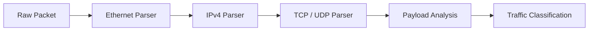

Every stage extracts additional information from the packet before forwarding it to the next stage.

---

# What is a Network Flow?

Packets belonging to the same communication session are grouped together into a **flow**.

A flow is uniquely identified using the **Five Tuple**.

| Field | Example |
|---------|---------|
| Source IP | 192.168.1.10 |
| Destination IP | 142.250.xx.xx |
| Source Port | 52311 |
| Destination Port | 443 |
| Protocol | TCP |

Instead of analyzing every packet independently, the engine tracks complete conversations.

This improves performance and ensures that firewall decisions remain consistent throughout the lifetime of a connection.

---

# How HTTPS Can Still Be Classified

A common misconception is that encrypted HTTPS traffic cannot be analyzed.

Although packet payloads are encrypted, the TLS handshake exposes the **Server Name Indication (SNI)** before encryption begins.

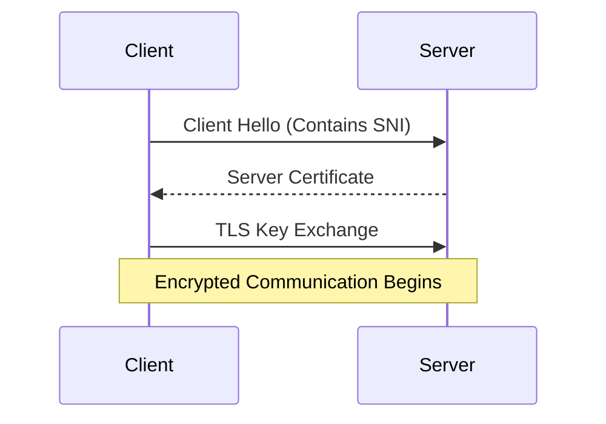

The SNI field contains the hostname requested by the client.

Example:

```
www.youtube.com

github.com

mail.google.com

facebook.com
```

This allows the engine to identify the application without decrypting the communication.

---

# Application Classification

After extracting the SNI, the engine maps domains to known applications.

| Domain | Application |
|---------|-------------|
| youtube.com | YouTube |
| github.com | GitHub |
| facebook.com | Facebook |
| google.com | Google |
| unknown | Unknown |

This classification powers the analytics dashboard and firewall engine.

---

# Firewall Decision Process

Once a flow has been classified, firewall policies are evaluated.

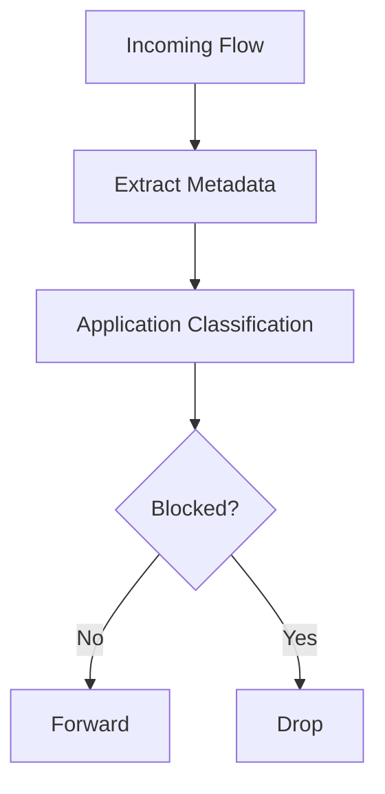

Supported rule types include:

- Block by IP Address
- Block by Domain
- Block by Application

The decision is stored for the entire flow so subsequent packets do not need to be reclassified.

---

# Analytics Generation

Every packet contributes to multiple statistics.

Examples include:

- Total Packets
- Total Bytes
- Protocol Distribution
- TCP vs UDP
- Active Connections
- Blocked Traffic
- Allowed Traffic
- Application Distribution
- Top Domains
- Firewall Events

These metrics are aggregated continuously and returned to the web dashboard for visualization.

---

# Bringing Everything Together

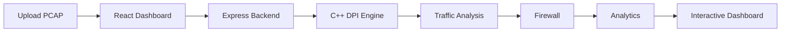

From a single PCAP file, the platform is able to parse packets, identify applications, apply firewall policies, generate statistics, and present the results through an intuitive web interface.

This architecture demonstrates how native packet-processing systems can be integrated with modern full-stack web technologies to build enterprise-style network monitoring platforms.
